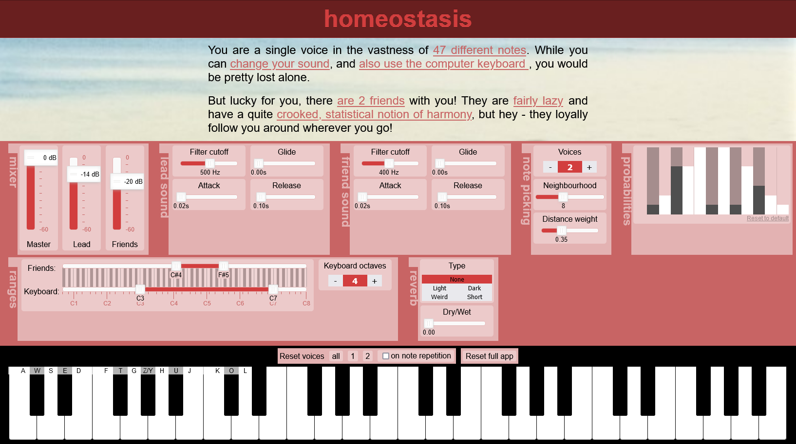

# homeostasis
Web Audio application creating harmonies to a playable lead synth. Still experimental, can be tried out live [here](https://michaelhochmuth.de/homeostasis/).

Current features:

-	Change up to 10 voices (friends) in reaction to a user-played lead voice, picking one of the most probable notes based on different factors:
	-	Joint probability of the intervals to all other notes (octaves subtracted)
	-	Distance from past note
-	Sound controls for lead and each friend voice: Lowpass filter, Attack and Release, Glide (for each voice individually)
-	Reverb with different impulse responses
-	Keyboard-controllable option to reset individual, or all voices.
-	Reaction to different screen sizes w.r.t. keyboard octaves and initial UI layout
-	UI with included explanations for each element
-	Configuration is stored and loaded in a cookie on the browser

ToDo:

-	Preset System
-	Re-think interval probabilities
-	Better selection of impulse responses for reverb
-	Option to disable explanations